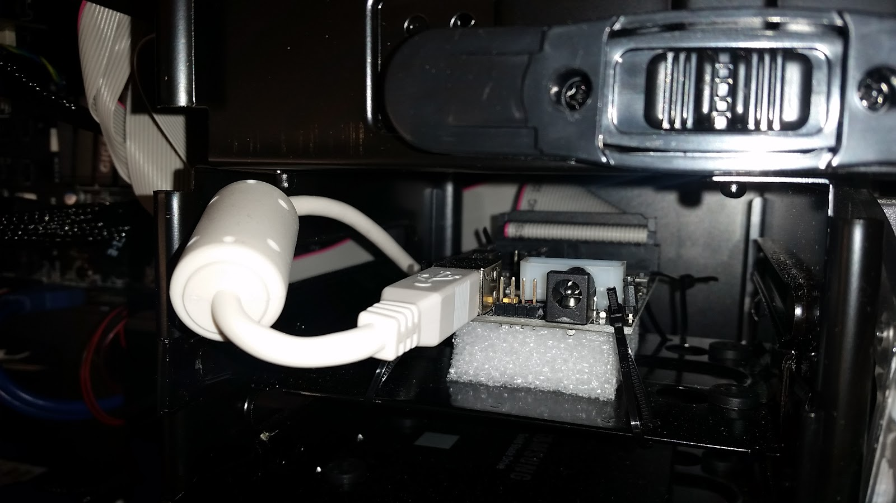
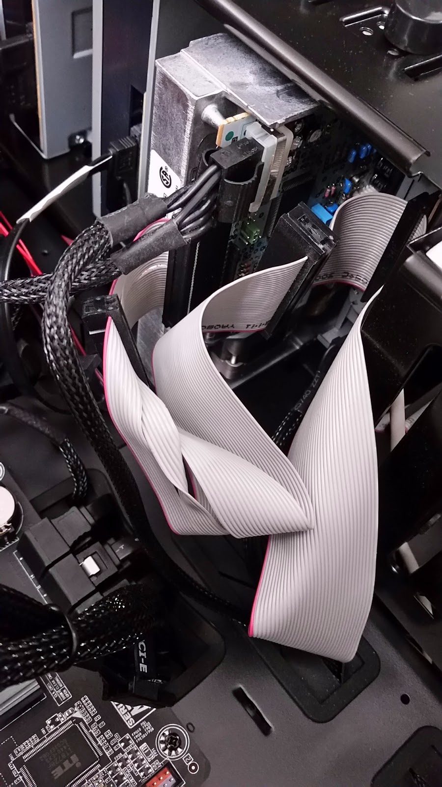
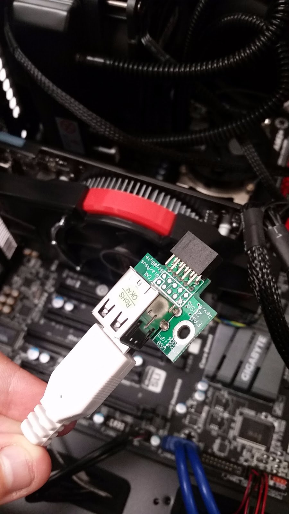

# Set-Up and Installation

## What's in the Box?

The KryoFlux setup consists of several pieces of hardware connected by cables (see figure 1). Because the KryoFlux board is so small and light, the setup can be a little precarious once connected. It also takes up more space than it does when boxed, so be sure that you have enough desk space to accommodate the various components. When moving hardware, handle it with caution, and have someone else help move the components as needed. As always when working with sensitive electronic components, take steps to protect against static electricity by using an anti-static mat or anti-static wristband; always place the KryoFlux board on a non-conductive surface while it is in use. 

*Figure 1: The various components included in the KryoFlux package. Depending on the package purchased by your institution, your box may also include a second backup KryoFlux board or a 5.25” floppy disk drive.*

## Downloading the Software

### Using Windows
1.	Download the directory containing KryoFlux driver and DTC files from the KryoFlux website: http://kryoflux.com/?page=download.

2.	Save the directory to your chosen location. Make a note of this location. For example: C:\Users\Public\Desktop\kryoflux_2.51_windows

### Using Mac

1. Download the JDK Java Runtime Platform files from the Oracle website: http://www.oracle.com/technetwork/java/javase/downloads/jdk8-downloads-2133151.html.

2. Run the JDK dmg file (it will have a name similar to this: jdk-8ku121-macosx-x64.dmg).

3. Download the KryoFlux software from the KryoFlux website: http://kryoflux.com/?page=download.

4. Save the downloaded KryoFlux file to your chosen location. Make a note of this location (MacOSX will place the download in the following path by default, ~/Downloads/kryoflux_2.62_macosx).

5. Unzip the downloaded file and navigate to the dtc folder.

6. Install DTC 

- Double-click KryoFlux.mpkg (see figure 2);
- Follow prompts to install the software.

*Figure 2: If using MacOSX, double-click KryoFlux.mpkg to install DTC.*

**NOTE:** You will need administrator rights to the computer to install the package.

**NOTE:** If you receive an unidentified developer warning (see figure 3) when trying to install the 
package, right click on the package and choose "Open" from the menu and then choose "Open" from the pop-up window.

*Figure 3: The unidentified developer MacOSX warning.*

### Using Linux

1. Download the Linux .tar file containing KryoFlux driver and DTC files from the KryoFlux website: http://kryoflux.com/?page=download

2. Save the .tar file and then use Archive Manager to extract the directory to your chosen location. Make a note of this location (for example, ~/Downloads/kryoflux_2.6_linux).

3. Launch a terminal window.

4. In the terminal window, type the following three commands (each followed by the Enter key) to install libusb and the JDK Java Runtime Platform:

	``sudo apt-get install libusb-1.0-0-dev``

	``sudo apt-get install libusb-dev``

	``sudo apt-get install openjdk-7-jre``

If they are already installed, the system will tell you that your version is up to date.

## USING LINUX: PREREQUISITES AND DEPENDENCIES

#### *UDEV RULE*
If this is your first time installing the KryoFlux software, you will also need to create a udev rule. The udev rule will prevent permissions errors as well as erasing the need for the user to root. (If this file is missing it is highly likely that the KryoFlux will not work properly.)

* To create this rule, navigate to the following directory: **/etc/udev/rules.d**
* While still in the above directory, create a file with the following title (use nano or a similar text editor): **80-kryoflux.rules**
* Type the following text into the file: **ACTION=="add", SUBSYSTEM=="usb", ATTR{idVendor}=="03eb", ATTR{idProduct}=="6124", GROUP="floppy", MODE="0660"**

#### *JAVA DEPENDENCY*
The KryoFlux software relies on Java to launch the GUI. In some cases, even though Java was installed on the Ubuntu Linux workstation, archivists observed that the KryoFlux GUI did not call Java correctly when launching the GUI by clicking on “kryoflux-ui.jar.” As a workaround, archivists at Princeton have developed a short [bash script](https://github.com/kellybolding/scripts/blob/master/run-kryoflux-gui.sh) that invokes Java each time they launch the GUI. This script lives on the workstation’s desktop and users click on it in order to start up the GUI in place of a desktop icon.

See also the [TROUBLESHOOTING](https://github.com/archivistsguidetokryoflux/archivists-guide-to-kryoflux/tree/master/03%20TROUBLESHOOTING) section for more information related to this issue.

## Setting Up the KryoFlux

While it does not require an especially high level of technical skill, setting up the KryoFlux does demand some careful attention to detail.  

**NOTE:**  Make sure to read this entire section before attempting to connect and power your board!

**NOTE:**  The floppy drive is an unstable source of power that can permanently damage the board, so it is imperative to follow the correct order when connecting/disconnecting KryoFlux.

**NOTE:**  If you suspect that you have a malfunctioning board or have damaged a board in the process of installing, and you have a backup board, do not use the backup board until you have successfully troubleshooted the original board. If you do not know why the original board is not working, you may inadvertently replicate the problem if you connect a backup board.

1. Always place the KryoFlux board on a non-conductive surface while it is in use. You may choose to use an anti-static mat or wristband, but typically this won’t be necessary and there’s debate about whether or not these types of anti-static devices will be helpful in a scenario like this one. NOTE: do not place the board on top of the anti-static bag in which the KryoFlux is shipped. The anti-static bags are conductive, and although the resistance is fairly high, it might cause data errors nonetheless.

2. Make sure the floppy disk drive is placed so that the spinning mechanism on its bottom side is not obstructed (i.e. on a raised surface that doesn’t cover the bottom of the drive, such as bridging the drive across the space between two DVD cases).

3. Enable write-blocking functionality by removing the jumper for the write gate (see figure 4).

4. Connect the drive to the board via the data cable. Ensure that the data cable’s first pin (the colored band) is oriented correctly. For more information about this, please see the [Understanding Drive 1/0](https://github.com/archivistsguidetokryoflux/archivists-guide-to-kryoflux/blob/master/02%20PART%20TWO%20In-Depth/Understanding-Drives-1-and-0.md) section.

	* For 3.5” drives, pin 1 must face left when the front of the drive is facing away from you. For some drives, this means that pin 1 will fact the outside of the drive when plugged in correctly, but this is not always the case. The rule of facing the drive away from you before plugging it in, and making sure that pin 1 faces left, should still be applicable to all 3.5” drives.  

	* For 5.25” drives, the same rule should apply. When the drive is facing away from you the first pin should be on the left.

	* On the KryoFlux side, the cable’s first pin should be on the right if viewing the board with the cable connector closest to you (as in figure 5).	
	

*Figure 4: Enable writeblocking functionality by removing the jumper for the write gate. This photograph shows the write gate once the jumper has been removed and writeblocking functionality enabled.*	

**NOTE:** If you are not familiar with the connectors on the data cable, the smaller ones connect to the board and to 3.5” drives, while the larger ones with gold lining connect to 5.25” drives.

5. Connect the KryoFlux board to the computer using the USB cable (see figure 5).
	

*Figure 5: Once the drive is connected to the KryoFlux board via the data cable, connect the board to the computer using the USB cable.*	
**NOTE:** If using Windows, proceed to step 6. If using Mac or Linux, skip step 6 and proceed directly to step 7.

6. WINDOWS USERS ONLY

**FIRST TIME WINDOWS USERS** (If using the KryoFlux on a Windows machine for the first time, you will need to complete the *Install the KryoFlux Drivers* instructions below. If, however, drivers are already installed, skip to *Launch the Command Prompt* step below):

* Install the KryoFlux drivers:

	* Launch the *Start* menu; 

	* Right-click on *Computer*;

	* Click *Properties*; 

	* Click *Device Manager*; 

	* Right-click on *Unknown Device* in the Device Manager menu (see figure 6). 

	* Select *Browse my computer for driver software*. Depending on your institution’s policies, you may need admin credentials starting with this step.

	* Click *Browse* and navigate to the folder where the KryoFlux directory was saved in step 2. 

	* Select the KryoFlux directory and click *Next*. 

	* Click *OK* on all of the prompts to install the drivers.

*Figure 6: Device Manager. One of the devices in this menu will be labeled “Unknown Device.” This is the KryoFlux. During installation, you may have to search through this list to find the “Unknown Device.” Once the KryoFlux has been recognized, however, it should be listed under Universal Serial Bus controllers. The steps are largely the same in Windows 10, although the presentation is slightly different.* 

**NOTE:** See the [TROUBLESHOOTING](https://github.com/archivistsguidetokryoflux/archivists-guide-to-kryoflux/tree/master/03%20TROUBLESHOOTING) if you have trouble with this step, or if your Windows 
instance seems to have forgotten the drivers in between KryoFlux sessions.

* Launch the command prompt:

	* Go to the *Start* menu and type ``command prompt`` command prompt or ``cmd`` into the search box and hit *Enter*.
	* Using the command prompt, navigate to the dtc folder (located inside the KryoFlux directory downloaded at step 1) (see figure 7). 
	* Type  ``dtc -c2`` into the command prompt, and press *Enter*. If DTC gives an error message, this means it is working (it tried to install the driver, but the driver was already there, so DTC returned an error). 
	
**NOTE:** the above steps may require admin credentials depending on your institution’s setup.

*Figure 7*

*Figure 8: Navigate to C drive by typing c: and pressing enter.*

7. Connect the floppy drive to the power. **This must be done last.**

	* Plug one end of the power adapter into the power supply. The 4 3 2 1 on the power adapter plug is faint and hard to read, but the 4 3 2 1 on the power supply and adapter should align when plugging the power supply into the adapter.
	
	*The other end is split and has two adaptor plugs. These plug into the floppy disk drive, *not* the KryoFlux board. The larger power adapter plug fits 5.25” floppy disk drives, while the smaller plug fits 3.5” floppy disk drives. You should *not* see a green light on the drive at this point. If the green light is on, the data cable has been connected to the drive backwards. 

	* Finally, plug the power supply into an outlet.

**NOTE:**  Use care when handling the power adapter! The wires are not anchored well and will 
come loose if not handled gently. When connecting and disconnecting the adapter, try not to pull on the wires themselves--grip the plastic plug casing instead. With frequent handling, it’s likely that the power adapter wires will come loose, but replacements are inexpensive.

**NOTE:** Because KryoFlux is based in Europe, you may need an adapter to plug the supplied 
power cable into the Type A / B outlets used in America. If you don’t have the appropriate adapter, the second half of a laptop or hard drive charger may work as a replacement for the second half of the power supply.

8.  In a terminal or command prompt window, navigate to the dtc folder located inside the KryoFlux directory downloaded at step 1 (see figure 7).

9. Insert a floppy disk into the floppy disk drive.

10. Type the following command into the terminal window:

	* **WINDOWS AND MAC USERS:** ``dtc -c2``
	* **LINUX USERS:** ``./dtc -c2`` 

11. Press *Enter.* 

**NOTE:** DTC will find the maximum number of tracks available. A floppy disk typically stores data across 80 tracks, but some drives can access as many as 83. 

You are now ready to start capturing disk images using the KryoFlux, either using the command line interface (CLI) or the graphical user interface (GUI). See [Using and interpreting DTC via the CLI](https://github.com/archivistsguidetokryoflux/archivists-guide-to-kryoflux/tree/master/01%20PART%20ONE%20Getting%20Started/02%20USING%20THE%20KRYOFLUX#using-and-interpreting-dtc-via-the-cli) and [Using and interpreting the graphical user interface (GUI)] 

## Disconnecting the KryoFlux

1. Disconnect the floppy drive’s power supply.
2. Eject and disconnect the USB cable.
3. Disconnect the data cable/floppy drive cable. 

## Handling the KryoFlux

### GOOD: Tips for basic handling and care
Because it does not have a protective outer shell or cover, the KryoFlux board is fragile and vulnerable to damage. A good rule of thumb is to try to **handle it as little as possible** to avoid damage, and to **put the board away after you’re done using it**--especially overnight or over the weekend--to prevent dust gathering. 

Another thing to keep in mind is that the board is particularly vulnerable to changes in the electrical current. The most obvious precautionary measures you can take to protect your KryoFlux are: 

1. **Plug its power supply into a surge protector**
2. **Always keep the KryoFlux away from conductive materials**, such as metal tabletops or other potential sources of static electricity. 
3. **Place the KryoFlux on top of something non-conductive while in use**, such as a book, folder, or cardboard box. This material will act as a buffer so that you avoid accidentally putting the KryoFlux in direct contact with a conductive material. You may choose to use an anti-static mat or wristband, but typically this won’t be necessary and there’s debate about whether or not these types of anti-static devices will be helpful in a scenario like this one. NOTE: do not place the board on top of the anti-static bag in which the KryoFlux is shipped. The anti-static bags are conductive, and although the resistance is fairly high, it might cause data errors nonetheless. 

### BETTER: Creating an enclosure
In institutions where only one person will be working with the KryoFlux, it may be sufficient to handle the board carefully as described above. In cases when multiple staff members will be using the board, it will be much more challenging to monitor use to ensure careful handling. 

Since the KryoFlux board is costly, you may want to look at simple enclosures. If your electronic acquisitions terminal is a commodity desktop tower or laptop computer, there is likely not going to be room in the housing to mount the board permanently. Archivists at Yale designed and wrote online about an enclosure they printed using a 3-D printer, and uploaded the design to [Thingiverse](https://www.thingiverse.com/thing:64058). It works relatively well, though there are a few caveats:

1. Depending on the 3D printer model available to you, a 3D print may have slight errors. One such enclosure printed with bits of additional polymer needed to be sanded down in order for the board to fit. At Emory, additional polymer supports, designed to help the enclosure maintain its shape during printing, later proved impossible to remove. 
2. There are now variations on the original enclosure design. The original is a two-piece object and includes a base and a lid. A second version features a slide that may introduce additional complexity. Since 3D printing is iterative, you may want to experiment with designs until you find one that is right.
3. Though the enclosure is protective, it is still fairly small and both objects together do not weigh much. We make sure to store ours at the end of a session. We leave the ribbon cable attached to the board, and store the board in its enclosure in a slightly larger box along with the ribbon.

### BEST: Installing KryoFlux in a computer tower
At Yale, the KryoFlux is installed internally in this dedicated disk imaging machine. The KryoFlux board is mounted to a disk shelf using zip ties to keep it from shifting inside the tower. A bit of foam is used between the kryoflux and the shelf as an insulator as well as preventing the board from scraping against the shelf. The first photo shows the USB cable from the front of the machine, the second photo shows the data cable attached through the back of the machine.

One note for future archivists attempting to internally install a KryoFlux: Be sure that the data cable is oriented correctly.  In the photo below you can see that the data cable is twisted in order to correctly connect to both the KryoFlux board and the floppy disk drive. The correct orientation is dependent on the specific drive you are working with. See the :ref:`Setting up the KryoFlux<>` instructions for more information.

The USB cable is connected to an internal USB port on the motherboard.  Some motherboards have USB ports installed; however, if your motherboard does not, you can purchase a USB header online for under ten dollars.  This USB header connects to the motherboard to provide two internal USB ports.  Shown here, the KryoFlux USB cable is connected to our USB header.
The greatest advantage to having the KryoFlux board mounted in this way, is that it is difficult to knock a cord loose, but if someone needs to remove the board or check the connections, the board can be disconnected and removed fairly easily as seen here.

*Figure 1: Tower install.*

*Figure 2: Tower install.*

*Figure 3: Tower install.*

*Figure 2: Tower install.*

*Figure 5: Tower install.*

