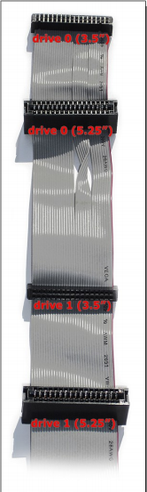

# Lessons Learned: KryoFlux Tales of Woe

## University of California Los Angeles

*Patricia Ciccone, Victoria Maches, Shira Peltzman, Scott Reed*

We ran into several issues while setting up the KryoFlux, both in terms of trouble with the physical setup process and problems with the KryoFlux after setup. 

At first, it was unclear which connector on the floppy data cable we were supposed to use, though we figured out that the smaller connectors were for 3.5” floppy drives after looking up pictures of KryoFlux boards that had already been set up, and paying attention to which connectors had been used. The power supply adapter needed more strength to plug in than expected. We were concerned about breaking the adapter if we used too much force, especially since the individual cables in the adapter were not anchored well and moved out of alignment fairly often. After several unsuccessful attempts to plug the power supply into the adapter, we decided our only option was to force it, which worked. Although we were concerned that we wouldn’t be able to plug the drive power supply into the outlet without a converter (it had a European-style plug), the KryoFlux website suggested using the power cord half of a hard drive or laptop charger, which we happened to have on hand. (Pro tip: if you don’t have one on hand, you can order one for around $4 online. See, for instance: https://www.computercablestore.com/10-ft-standard-laptop-power-cord-c7-wo-polarized).

We finished the physical set-up and were able to successfully download and install the DTC software without encountering any further problems, but we hit a major stumbling block when it came time to calibrate the drive. Calibration, which typically takes about 30 seconds to complete, repeatedly failed. Instead, after a wait of about 40 minutes, the DTC software returned an error. When we tried to calibrate the drive again after checking the drive cable and power supply connections, the same thing happened. When we tried again the next day, the red LED on the board went out, and the board never worked again. The same thing happened to our backup board when we tried to use it instead. At this point, we were still unsure of whether there was something wrong with the DTC software, or if we had damaged our boards. 

We contacted KryoFlux, and they asked us to send the boards back so that they could assess the problem. We are still unsure of exactly what happened to our original boards, but after inspecting them, the KryoFlux folks provided us with their best guess as to what the problem might have been: Our computer’s USB port may have provided too much power to the KryoFlux, which eventually caused the boards to fry. They assured us that future boards would have slower fuses in order to prevent this problem from happening again. Alternatively, we may have fried the boards by disconnecting them improperly, or the problem may have been some combination of these two issues (i.e. one board received too much power, and the other was improperly disconnected). However, the USB issue is our best guess at what happened, and we could not have prevented that. A later email from KryoFlux explained that our boards had blown fuses, and that these fuses could be replaced if this were to happen again.

To avoid frying the board by disconnecting it improperly, follow the instructions in [Setting Up the KryoFlux](../01%20SET-UP%20AND%20INSTALLATION/README.md#settingupthekryoflux) and [Disconnecting the KryoFlux](../01%20SET-UP%20AND%20INSTALLATION/README.md#disconnectingthekryoflux).

**Note**: Christian Bartsch, Managing Director and Founder of KryoFlux Products and Services Ltd., provided some additional technical explanation related the experience that archivists and students from UCLA describe above:

> Recent USB ports have become really powerful due to people charging their phones via the PC. Much of the  “cheap“ USB equipment simply does not have fuses, e.g. USB hubs from China where the fuse (present on the board’s layout) is simply bridged with wire.
> 
> So, KryoFlux has a fuse for various reasons. One is that drives, especially 5.25“ and 8“ drives, can generate significant (and unwanted) drainage and having a component (the KryoFlux) connected to something very powerful (the USB port) could cause damage. It might have happened that such drainage (which is a complex result of the different connections between the PC and the other outlet used for the PSU, plus the surface where the components are placed has triggered the fuse. [EDITOR’S NOTE: Always place the KryoFlux board on a non-conductive surface while it is in use. You may choose to use an anti-static mat or wristband, but typically this won’t be necessary and there’s debate about whether or not these types of anti-static devices will be helpful in a scenario like this one. NOTE: do not place the board on top of the anti-static bag in which the KryoFlux is shipped. The anti-static bags are conductive, and although the resistance is fairly high, it might cause data errors nonetheless.]
> 
> Such damage would only affect the fuse (as opposed to the board itself) which blows ("fries") for the reason of protecting 30+ year old technology. 
> 
> The replacement fuse recommended is this one:https://www.digikey.de/product-detail/en/bel-fuse-inc/0ZCJ0050FF2G/507-1802-1-ND/4156236?keywords=507-1802-1-nd&cur=EUR&lang=en
> 
> Having the fuse replaced by a trained technician will not void the warranty. Also, this replacement fuse, which is used for later KryoFlux boards, is self-resetting and will reset itself after a minute or two.

## Princeton University

*Elvia Arroyo-Ramirez, Kelly Bolding, Faith Charlton, Allison Hughes*

**Why won’t the drive calibrate?**

After setting up the KryoFlux and installing the driver in Windows per the software installation instructions (p. 8-10 of the <a href="http://www.kryoflux.com/download/kryoflux_manual.pdf">official KryoFlux manual</a>) with apparent success, we tried to calibrate it. The calibration worked fine in the command line (i.e., we typed “dtc -c2” and it gave us the message “CM: maxtrack=83”) but when we attempted to calibrate in the GUI (which is what we really wanted to use, for the visualization tool and to make things easier for delegating bulk disk imaging work to student assistants) we got an error message: “Error: Could not communicate with floppy drive.”  We tried disconnecting and restarting the computer but the problem persisted. We were super confused why it would be working in one place and not the other so we wrote to the KryoFlux support team, who advised us that we had probably selected the wrong drive in the GUI, and indeed, when we switched from Drive 1 to Drive 0 it worked with no problems.

It’s unclear why switching from Drive 1 to Drive 0 solves this problem. We thought initially that perhaps our data cable connections were reversed, but feedback from the KryoFlux development team suggest this is incorrect. Whatever the reason, however, this solution worked for us and did not cause any damage to our KryoFlux board. In summary, if the KryoFlux won’t calibrate using one drive, try the other.

**Why isn’t the KryoFlux showing up when I plug it in?**

*It’s showing up as a Bossa Port:*
If the KryoFlux is coming up as a “Bossa” device, go to Device Manager -> Ports (COM & LPT). Right-click on the Bossa device listed and Uninstall, making sure that the “delete driver software” box is checked. Unplug the KryoFlux. Disconnect from the internet. Plug in the KryoFlux again and it should come up as “Unknown device”. Install driver software from local files. Once it comes up as KryoFlux again you can turn the internet back on. Note that if you try to “update driver software,”  Windows will tell you you already have the best driver for the device installed and won’t let you change to the KryoFlux driver.

*It’s not showing up at all:*
If Windows is not recognizing anything when you plug in the KryoFlux, check whether it will recognize other USB devices. If the computer has stopped recognizing any USB devices, try Method 3 here: https://support.microsoft.com/en-us/kb/817900. This issue happened to us frequently when we were using the Kyroflux with a Dell laptop and regularly disconnecting and reconnecting it.

**Why is the Settings window blank when I use the KryoFlux GUI?**
 
At Princeton, even though Java was installed on the Ubuntu Linux workstation, archivists observed that the KryoFlux GUI did not call Java correctly when launching the GUI by clicking on “kryoflux-ui.jar.” The GUI would appear to open correctly, but important functionality would be missing (such as a completely blank Settings window). We found a tip for bypassing this problem several paragraphs into the “README.linux file” that comes with the KryoFlux software download for Linux; these instructions indicate that the command “java -jar kryoflux_ui.jar” makes Java available when running the GUI. When we opened the GUI by running this command in the terminal, there was no more blank Settings window and the software was fully operational! To avoid having to run this command in the terminal every single time we use the GUI, we dropped the command into a very short bash script. As a workaround, archivists now use the script each time they launch the GUI. This script lives on the workstation’s desktop and users click on it in order to start up the GUI in place of a desktop icon. The script [link] we use is available on GitHub -- feel free to grab it; just be sure to edit the file path to match the installation location of your KryoFlux software package.
