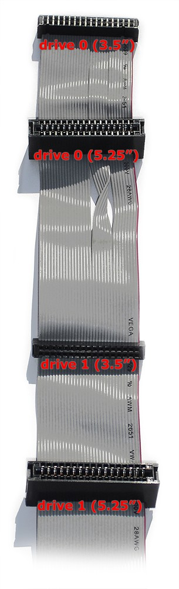

# Understanding Drives 1 and 0

 
Each board comes with a floppy data cable which has two sections, each section has two connectors (one for each drive type, 3.5 and 5.25 inch).  The section that is connected to the drive determines if that drive will appear as Drive 1 or Drive 0 in the GUI.  The connectors closest to the KryoFlux board will usually appear as Drive 1 and the connectors furthest from the board appear as Drive 0. It's also important to note that you have to set the jumper on the board itself to support a dual drive setup. 

When connecting the data cable to the drive you can only connect one drive to one section at a time.  If you are connecting two drives to a kryoflux board, be sure that you use one connector from each section of the data cable.  Make sure you have documented which drive is associated with which section.  This will be important to know in order to calibrate the correct drive for use. The order of which drive is associated with which drive number (1 or 0) does not affect the usage of the KryoFlux, but it must be documented in order to know which drive to calibrate.

*Figure 1: Example 34-pin IDE ribbon marking which connectors correspond to Drive 0 and which to Drive 1.*
