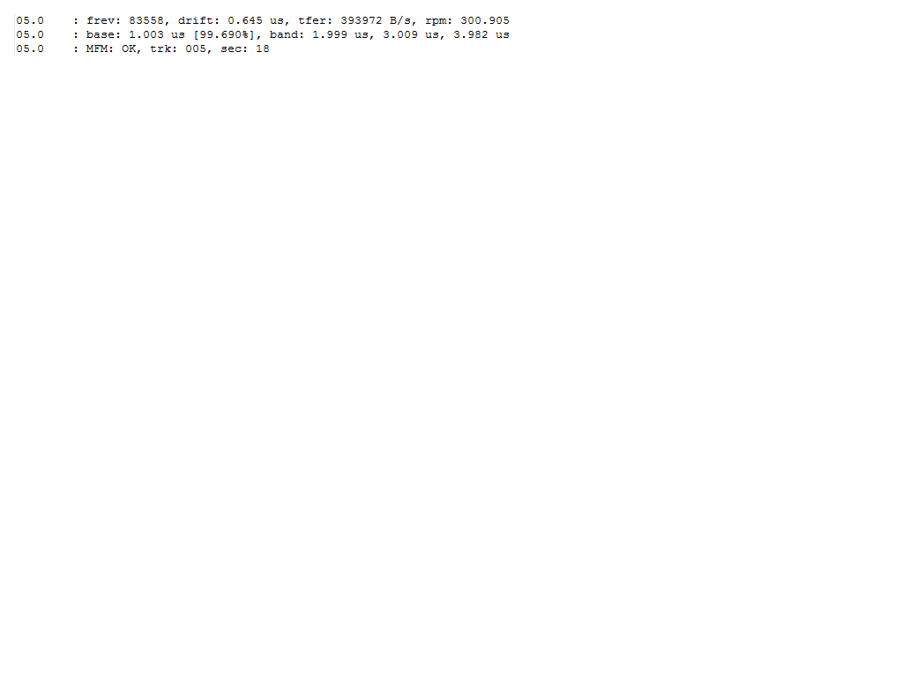

.. Log files:

=========
Log Files
=========

The Disk Tool Console (DTC) application maintains a log of benchmarks as it runs over a floppy disk. If running the application on the command line (CLI), the user needs to specify a filename for the log to be saved as, otherwise it will print to stdout. By default, the graphical user interface (GUI) saves this file in the location specified during configuration. This section describes the information included in a log file and how it might be interpreted before discussing the merits of saving the log files as metadata or supporting documentation. 

-------------------
Log files in brief:
-------------------

Somewhat confusingly, the logs output by the CLI and GUI are somewhat different in how each displays data, though the data conveyed is ultimately similar. A log file, regardless of its origin, contains the following information per track (and side, if applicable):

* tfer: the average transfer rate (bytes/second)
* rpm: revolutions per minute of the disk in the drive
* base: the base data band used in the track. This is calculated in two ways: from what is expected given the encoding scheme (MFM/FM/GCR) and what is detected on the disk surface by DTC. Data unit recorded in *μ*, though represented as *u* in the log file.
* band: the additional data bands used for recording information. Like the base, this is calculated both by detection and by what is expected by the encoding scheme directed by the user. Data unit recorded in *μ*, though represented as *u* in the log file. Per the official manual,[1]_ floppies encoded FM should expect 2 bands in addition to the base, and disks encoded either MFM or GCR should expect 3 bands in addition to the base. 
* encoding outcome: based on how encoding methods are specified by the user, the log will report whether DTC could successfully decode data, successfully decode data with warnings, or not successfully decode data. Warning codes are detailed on page 22 of the official KryoFlux manual (though warning codes are presented as lower-case letters in the manual, and upper-case letters in the log file).

This data is presented in three line chunks, prefaced by a three-digit code specifying the track and side that the following data pertain to. In the following image, 05.0 refers to track 5, side 1. These lines will repeat if the user has specified that DTC should retry tracks more than once.
  

  
*Figure 1: Example snippet from a log file.*

The GUI log includes two extra features not present in the CLI log:

 - The first line of a GUI-derived log file contains the corresponding command DTC ran as if it had run from the CLI
  
  
  .. [1] http://www.kryoflux.com/download/kryoflux_manual.pdf
