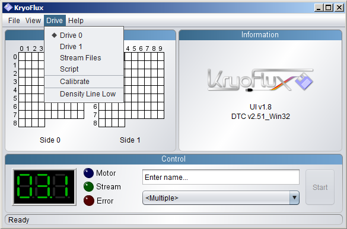

.. _Using-the-KryoFlux:

===================
Using the KryoFlux
===================

.. _GUI-vs-CLI:

------------
GUI vs. CLI:
------------

The Kryoflux’s Disk Tool Console (DTC) is the command line application that sits 
underneath the Kryoflux’s graphical user interface (GUI). 

The KryoFlux provides two options for interacting with DTC:

1.	Use the graphical user interface (GUI)
2.	Run DTC using the command line interface (CLI)

Both provide similar functionality, and the writers of this guide do not endorse one 
approach over the other. Your decision as to which to use will likely depend in part 
on your own experience and personal preference. That said, the following summary 
provides an overview of some of the differences between the two.

**Ease of use for beginners**

THE WINNER: The GUI
As might be expected, the GUI provides a more intuitive interface and a lower 
barrier of entry to use. Its color-coded interface provides immediate and 
easily-interpreted feedback, allowing users to quickly determine whether imaging is 
likely to have been successful. It might be an obvious choice for those who are 
unfamiliar with the command line. Documentation about the GUI is more widely 
available and more accessible than its CLI counterpart, which tends to assume some 
existing knowledge of the command line. 

**Efficiency and flexibility**

THE WINNER: The CLI
In terms of efficiency and flexibility, the CLI may just pip the GUI to the 
post--especially if you are imaging a large number of disks. Whereas changing a 
setting using the GUI might involve several clicks, changing a setting using the CLI 
only requires typing the relevant option in the command. It’s a small difference, 
but may be enough to sway you towards the CLI if your aim is to get through as many 
disks as you can in the shortest possible time.

Similarly, use of the CLI also allows for the development of simple scripts that 
could run a series of commands with one keystroke--which you may or may not deem 
necessary, depending on your workflows. This does, of course, require some scripting 
expertise--but the opportunity to simplify imaging procedures may be motivation 
enough to start learning.

Finally, the number of options available using the CLI may provide more advanced 
users with added flexibility. The CLI, for example, allows greater control over what 
information is reported as part of the KryoFlux’s log files.

**Reporting**

THE WINNER: The GUI
A particularly nice feature of the GUI are the visualizations that it provides as 
data is being imaged. Color-coded blocks provide immediate feedback on whether 
imaging has been successful. The use of red, orange, green, and grey blocks to 
represent bad, modified, good, and unrecognised data respectively is intuitive, and 
provides a quick and holistic overview for the user.

In the course of creating STREAM files, the GUI also provides visualizations of the 
flux data as a scatter plot graph and, if you’re the sort of person who knows how to 
interpret flux data as represented in a scatter plot graph, these can help diagnose 
media or hardware problems—or so I’ve been told. If you’re not the sort of person 
who knows how to interpret flux data as represented in a scatter plot graph, these 
can at least draw your attention to where problems might be lurking—even if you are 
not able to fully diagnose them (see Gough Lui’s `Project KryoFlux 
<http://goughlui.com/2013/04/21/project-kryoflux-part-3-recovery-in-practise/>`_ 
series of Blog posts for more information).

Command line output provides similar levels of information, but its text-heavy 
delivery may not be quite as digestible as the GUI’s visualizations. That said, 
command-line options can be used to control the level of detail included in the 
DTC’s output, which may help users weed out information deemed overly technical and, 
ultimately, unnecessary (for an example of this, see :ref:`Working with 40-track 
floppy disks)<>`.

.. _Using-and-interpreting-the-GUI:

----------------------------------------------------------
Using and interpreting the graphical user interface (GUI):
----------------------------------------------------------

.. _Capturing-disk-images:

^^^^^^^^^^^^^^^^^^^^^^
CAPTURING DISK IMAGES
^^^^^^^^^^^^^^^^^^^^^^

1.	Launch the KryoFlux GUI, either by clicking the desktop icon, or by opening the 
	DTC folder where the GUI installer was located and double-clicking on the file 
	called kryoflux-ui.jar.

NOTE: Java is required in order to launch the GUI. Instructions for installing Java 
and other dependencies can be found in the :ref:`Downloading the Software section<>`.

2.	At the beginning of each imaging session calibrate the floppy drive by selecting 
	the correct drive from the Drive menu then selecting Calibrate from the same 
	menu (see figure 9). You should only need to calibrate the drive once per 
	imaging session and any time you switch between 3.5-inch and 5.25-inch disk 	
	drives.
	
NOTE: See the :ref:`troubleshooting section<>` if you experience difficulties in 
calibrating your drive when using the GUI.

*Figure 9: Select the correct drive from the Drive menu, then select Calibrate.*

